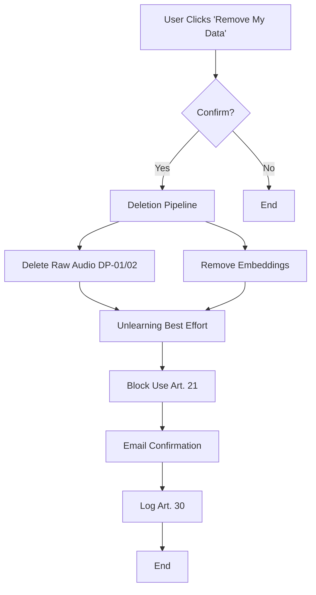

 
Guidance on Personal Data
 
in Generative Music Systems
 

 <!-- Image and text side-by-side --> 
 
  
 
 
Open-Source
 
Science Guidance
 
for AI Music Generation Tools
 
 
 <!-- Footer - positioned at bottom of first page --> 
 <strong>Version 1.0</strong> | Dec 2025  <strong>Prepared by:</strong> Petra Kühnle 

---

# 1. Purpose and Scope

This guidance applies to all generative music models that:

- Accept user-uploaded audio (voice, instrument, full tracks)
- Use such uploads for training, fine-tuning, or inference
- Generate new musical output for end users

---

# 2. Document Control

|Version|Date|Author|Editor|Summary of changes|
|---|---|---|---|---|
|1.0|Dec 2025|Petra Kühnle|Petra Kühnle|Initial release|

---

# 3. Normative References

- [Regulation (EU) 2016/679 (GDPR)](https://eur-lex.europa.eu/eli/reg/2016/679/oj)
- [Regulation (EU) 2024/1689 (EU AI Act) – high-risk AI systems](https://eur-lex.europa.eu/eli/reg/2024/1689/oj)
- [ICO Guidance on AI and Data Protection (2023–2025)](https://ico.org.uk/for-organisations/uk-gdpr-guidance-and-resources/artificial-intelligence/guidance-on-ai-and-data-protection/)
- [ENISA "Securing Machine Learning Algorithms" (2021)](https://www.enisa.europa.eu/publications/securing-machine-learning-algorithms)

---

# 4. Definitions

|Term|Definition|
|---|---|
|**Training Data Opt-In**|Explicit, granular, and withdrawable consent to use uploaded audio for model training|
|**Voice Biometric Data**|Special-category personal data under Art. 9 GDPR|
|**Style Leakage**|Unintended reproduction of an individual artist's recognizable style in outputs|

---

# 5. Mandatory Requirements

## 5.1 Lawful Basis and Consent Architecture

|Req ID|Requirement|Implementation Notes|
|---|---|---|
|**LB-01**|Explicit consent required for any training use|Default OFF, separate checkbox|
|**LB-02**|Consent withdrawal must trigger data deletion pipeline|One-click "Remove my data" button|
|**LB-03**|No bundling of training consent with service access|Freely given (Recital 43)|

## 5.2 Transparency Obligations

|Req ID|Requirement|
|---|---|
|**TR-01**|Privacy notice at point of upload (layered notice)|
|**TR-02**|Inform users if outputs may contain traces of others' data|
|**TR-03**|Provide high-level explanation of how the model works|

## 5.3 Data Protection by Design

|Req ID|Requirement|
|---|---|
|**DP-01**|End-to-end encryption of raw uploads|
|**DP-02**|Automatic deletion of raw audio after 30 days unless opted-in for longer retention|
|**DP-03**|Training-data anonymization where technically feasible|

## 5.4 Fairness and Bias Mitigation

|Req ID|Requirement|
|---|---|
|**FB-01**|Document demographic/genre distribution of training data|
|**FB-02**|Annual bias audit of generated outputs|

## 5.5 Data Subject Rights Pipeline

|Req ID|Maximum Response Time|Technical Implementation|
|---|---|---|
|**Access (Art. 15)**|30 days|Download raw + embeddings|
|**Erasure (Art. 17)**|Immediate|Delete + model unlearning (best effort)|
|**Objection (Art. 21)**|Immediate|Block future use|

---

# 6. Data Protection Impact Assessment (DPIA)

Mandatory pre-deployment DPIA template available in Appendix A.

---

# 7. Record of Processing Activities (Art. 30)

Tracked in GitHub: [Music AI Vault Repository](https://github.com/Pi-Kay/Music-AI-Vault)

---

# Appendix A – DPIA Template

**Version 1.0 – December 2025** | Prepared by: Petra Kühnle

This template meets Art. 35 GDPR for high-risk AI under EU AI Act. Complete pre-deployment for models handling personal data (e.g., voice biometrics). Reference guidance (e.g., 5.1 Lawful Basis). Consult DPO; escalate unmitigated risks to authority (e.g., ICO).

## 1. Project/Processing Overview

- **Project Name:** [Insert]
- **Department/Owner:** [Insert]
- **Date of DPIA:** [Insert]
- **Purpose:** [Describe]
- **Stakeholders:** [List]
- **Scope:** [Per Section 1]
- **High-Risk Classification:** [Explain, e.g., Art. 9 special data]

## 2. Processing Activities Description

_Per Art. 35(7)(a)._

- **Personal Data Categories:** [List; ref. Section 4]
- **Data Subjects:** [List]
- **Data Sources:** [e.g., Opt-in uploads]
- **Operations:** [Describe flows]
- **Recipients/Sharing:** [List]
- **Transfers:** [Yes/No; safeguards]
- **Retention:** [e.g., Per DP-02]
- **Automated Decisions:** [Describe]

## 3. Necessity/Proportionality

_Per Art. 35(7)(b)._

- **Lawful Basis:** [Justify; ref. 5.1]
- **Necessity:** [Explain]
- **Proportionality:** [Assess]
- **Alternatives:** [List]

## 4. Risk Identification/Assessment

_Per Art. 35(7)(c). Use matrix (Likelihood x Impact)._

- **Risks:** [e.g., Privacy, bias (FB-01), style leakage]
- **Likelihood/Impact:** [Rate]
- **Affected Rights:** [e.g., GDPR rights]

## 5. Mitigations/Safeguards

_Per Art. 35(7)(d)._

- **Technical:** [e.g., DP-01 encryption]
- **Organizational:** [e.g., FB-02 audits]
- **Transparency:** [e.g., TR-01 notices]
- **Rights Support:** [Ref. 5.5]
- **Residual Risks:** [Reassess]
- **Monitoring:** [Plan]

## 6. Consultation

- **Internal:** [Describe]
- **External:** [If needed]
- **Data Subjects:** [Optional]

## 7. Conclusions/Recommendations

- **Assessment:** [Summarize]
- **Action Plan:** [List]
- **Review Triggers:** [List]

## 8. Sign-Off

- **DPO:** Name/Signature: ________ Date: ________
- **Owner:** Name/Signature: ________ Date: ________
- **Management:** Name/Signature: ________ Date: ________

**Annexes (Optional):** Flows, matrix, consultations, links to B/C.

_Maintain living; review annually. Store per Section 7. Adapt for non-EU (e.g., CCPA). Ref: ICO Guidance (2023–2025), ENISA (2021)._

---

# Appendix B – Model Card Template for Music Models

**Model Card Template for Music Models** | Version 1.0 – December 2025 | Prepared by: Petra Kühnle

_Document for transparency/compliance. Complete per model; maintain with Section 7._

## 1. Model Details

- **Basic Info:** Name/Version/Date/Developers/License/Contact
- **Description:** [Architecture, I/O, capabilities]
- **Resources:** [Compute, carbon estimate]

## 2. Intended Use

- **Primary:** [Compliant scenarios]
- **Out-of-Scope:** [Prohibited, e.g., no DPIA]

## 3. Factors

- **Relevant:** [e.g., Bias in genres/demographics]
- **Mitigations:** [Ref. FB-01/02]

## 4. Evaluation

- **Metrics:** [e.g., FAD, leakage rate]
- **Data:** [Datasets, diversity]
- **Results:** [Summarize]
- **Ethics:** [e.g., Consent-based data]

## 5. Ethical Considerations/Risks

- **Fairness/Bias:** [Risks/mitigations]
- **Privacy:** [Risks/mitigations, e.g., DP-01/02]
- **Transparency:** [Per TR-03]
- **Other:** [e.g., Misuse]

## 6. Training Data

- **Sources:** [e.g., Opt-in]
- **Preprocessing:** [e.g., Anonymization]
- **Composition:** [Breakdown; ref. FB-01]
- **Controls:** [Per LB-01–03]

## 7. Recommendations

- **Deployers:** [e.g., DPIA]
- **Users:** [e.g., Notices]
- **Maintenance:** [Updates]

## 8. Glossary

[Terms from Section 4]

## 9. References

[From Section 3]

_Update on changes._

---

## Acknowledgments

Cover image generated by Grok with author's original prompt. Content research accelerated by Grok from public web sources.

---

# Appendix C – Consent Withdrawal Flow Diagram

**Consent Withdrawal Flow Diagram** | Version 1.0 – December 2025 | Prepared by: Petra Kühnle

_Process per LB-02, Arts. 17/21 GDPR. Meets Section 5.5 response times._

## Flow Description

1. **User Action:** User clicks "Remove My Data" button
2. **Confirmation:** System prompts for confirmation
    - If **No** → Process ends
    - If **Yes** → Proceed to deletion pipeline
3. **Deletion Pipeline:**
    - Delete raw audio (per DP-01/02)
    - Remove embeddings from system
    - Trigger model unlearning (best effort)
    - Block future use (Art. 21)
4. **Confirmation:** Send email confirmation to user
5. **Logging:** Record action per Art. 30
6. **Complete:** Process ends

---

**Visual Flowchart:** _The Mermaid diagram code below generates an interactive flowchart in digital formats. In PDF exports, refer to the flow description above._

